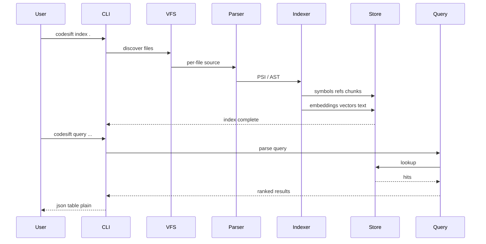

# Data Flow

Lifecycle of data through codesift from cold start to query and export.

## Index lifecycle



## Cold start (full index)

1. **Discover** — Walk workspace with `ignore` (respect `.gitignore`, `.codesiftignore`)
2. **Hash** — Compute blake3 content hash per file
3. **Parse** — Build PSI per file (parallel where safe)
4. **Extract** — Structural indexer emits symbols, refs, call edges
5. **Chunk** — Semantic indexer splits into chunks at symbol boundaries
6. **Embed** — fastembed generates vectors; cache by content hash
7. **Write** — Persist to fjall, usearch, tantivy atomically per batch
8. **Meta** — Update `meta.json` with `workspace_rev`, file counts, versions

## Incremental update (watch mode)

1. **Notify** — File create/modify/delete event
2. **Invalidate** — Lookup files depending on changed symbols (invalidation graph)
3. **Reparse** — Incremental parse (`tree.edit()` or r-a incremental)
4. **Diff** — Compare old vs new symbol set for file
5. **Tombstone** — Mark removed symbols; delete stale refs/edges
6. **Patch** — Write new symbols; update cross-file refs in affected files
7. **Re-embed** — Only changed chunks (content hash miss)
8. **Bump** — Increment `workspace_rev` if symbol IDs affected

See [../specs/incremental-indexing.md](../specs/incremental-indexing.md).

## Query flow

### Structural query

```
query string → parser → AST → fjall lookups → merge → format
```

Example: `callers:of=sym://...` → reverse edge index → caller list

### Semantic query

```
natural language → embed query → usearch top-k
                 → tantivy BM25 boost
                 → fastembed rerank
                 → structural boosts → format
```

### Hybrid query

Combines structural filters (pre-filter in usearch/tantivy) with semantic ranking.

## Export flow

```
codesift export --format jsonl
  → read symbols, chunks, edges from fjall
  → serialize as JSON lines (not postcard)
  → stdout or file
```

For downstream SAST/lint tools that do not read `.codesift/` natively.

## Failure and recovery

| Condition | Action |
|-----------|--------|
| Corrupt fjall segment | Rebuild from source (`codesift index --force`) |
| Version mismatch in meta.json | Migration or full rebuild |
| Parse error in file | Index partial symbols; record error in `file_state` |
| Embedding model missing | Skip semantic index; structural still works |

## See also

- [incremental-indexing.md](../specs/incremental-indexing.md)
- [storage.md](../specs/storage.md)
