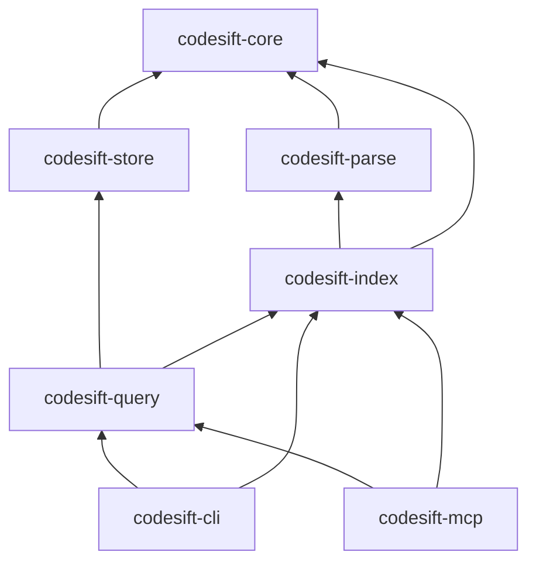

# Future Crate Layout

Planned Cargo workspace structure for when implementation begins. **No Rust code exists yet.**

## Workspace

```
codesift/
├── Cargo.toml              # workspace root
├── crates/
│   ├── codesift-core/
│   ├── codesift-parse/
│   ├── codesift-index/
│   ├── codesift-store/
│   ├── codesift-query/
│   ├── codesift-cli/
│   └── codesift-mcp/
└── docs/                   # (this tree)
```

## Crates

### codesift-core

Foundation types shared across crates.

- `Workspace`, `FileId`, `Location`, `Language`
- `Error`, config types
- VFS: file walk (`ignore`), hashing (`blake3`), watcher (`notify`)

**Public API stability:** high — other crates depend heavily on this.

### codesift-parse

Language parsing and PSI extraction.

- tree-sitter integration (multi-language)
- `ra_ap_syntax` backend for Rust
- `PsiProvider` trait: `fn extract_symbols(&self, file) -> Vec<SymbolDraft>`
- tree-sitter query files per language (`.scm`)

### codesift-index

Index builders — structural and semantic.

- Structural: symbol/ref/edge writers
- Semantic: chunker, embedder wrapper (fastembed)
- Incremental diff and tombstone logic
- Orchestrates full and incremental index passes

### codesift-store

Persistence layer — thin wrappers over backends.

- `KvStore` → fjall keyspaces
- `VectorIndex` → usearch
- `TextIndex` → tantivy
- postcard serialize/deserialize for records
- `meta.json` read/write

### codesift-query

Query parsing and execution.

- Structural query parser
- Semantic + hybrid execution plans
- Result ranking and pagination
- No I/O beyond store trait bounds

### codesift-cli

Binary: `codesift`

- Commands: `index`, `watch`, `query`, `search`, `symbol`, `refs`, `export`, `status`, `mcp`
- Output formatting: json, table, plain
- clap derive API

### codesift-mcp

Binary or subcommand: MCP server

- rmcp `ServerHandler` implementation
- Tools per [specs/mcp.md](../specs/mcp.md)
- stdio transport (primary)

## Dependency graph



## Workspace Cargo.toml (sketch)

```toml
[workspace]
resolver = "2"
members = ["crates/*"]

[workspace.package]
version = "0.1.0"
edition = "2024"
license = "Apache-2.0"

[workspace.dependencies]
# See technology-stack.md for versions
fjall = "3.1"
usearch = "2.25"
tantivy = "0.26"
tree-sitter = "0.26"
fastembed = "5.15"
rmcp = "1.7"
clap = "4"
postcard = "1"
serde = "1"
tokio = "1"
```

## See also

- [technology-stack.md](technology-stack.md)
- [components.md](components.md)
