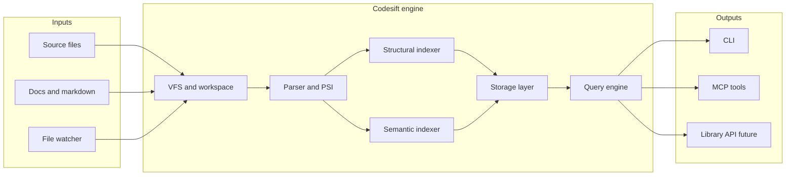

# Architecture Overview

codesift is a layered indexing engine: ingest files, parse to PSI, write structural and semantic indexes, serve queries via CLI and MCP.

## System diagram

## Boundaries

| Inside codesift | Outside codesift |
|-----------------|------------------|
| Parse, index, store, query | Type checking, compilation |
| Symbol/ref/call graph (syntax-level) | Full name resolution / inference |
| Local embeddings and BM25 | Remote LLM inference |
| CLI and MCP transport | IDE UI, editor plugins (consumers) |

## Layers

1. **Ingestion** — VFS, gitignore rules, file watcher, content hashing
2. **Parsing** — tree-sitter (multi-lang), `ra_ap_syntax` (Rust depth)
3. **Indexing** — structural (symbols, refs, edges) and semantic (chunks, embeddings)
4. **Storage** — fjall (KV), usearch (vectors), tantivy (text)
5. **Query** — structural DSL, semantic search, hybrid fusion
6. **Interfaces** — clap CLI, rmcp MCP, future library API

## Deployment model

codesift runs **embedded** in the user's environment:

- Index stored at `{workspace}/.codesift/`
- No required network or external database
- CLI invoked on-demand; MCP server holds workspace session over stdio

## See also

- [data-flow.md](data-flow.md)
- [components.md](components.md)
- [technology-stack.md](technology-stack.md)
- [../specs/README.md](../specs/README.md)
