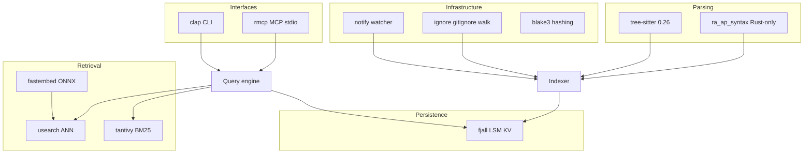

# Technology Stack

**Status:** accepted (June 2026 research)

Research-backed crate choices for codesift. Each major choice has a corresponding ADR.

## Stack diagram



## Layer recommendations

| Layer | Crate | Version | ADR | Rationale |
|-------|-------|---------|-----|-----------|
| Structural KV | [fjall](https://crates.io/crates/fjall) | 3.1.x | [0004](../adr/0004-storage-and-retrieval-stack.md) | Pure Rust LSM, keyspaces, strong write perf |
| Vector ANN | [usearch](https://crates.io/crates/usearch) | 2.25.x | [0004](../adr/0004-storage-and-retrieval-stack.md) | SIMD, filter predicates, save/load |
| Text search | [tantivy](https://crates.io/crates/tantivy) | 0.26.x | [0006](../adr/0006-tantivy-for-text-search.md) | BM25, incremental, fast CLI startup |
| Multi-lang parse | [tree-sitter](https://crates.io/crates/tree-sitter) | 0.26.x | [0003](../adr/0003-tree-sitter-for-parsing.md) | Incremental, query DSL, broad grammar support |
| Rust parse | [ra_ap_syntax](https://rust-lang.github.io/rust-analyzer/syntax/) | tracks r-a | [0003](../adr/0003-tree-sitter-for-parsing.md) | Lossless CST, edition-aware |
| Embeddings | [fastembed](https://crates.io/crates/fastembed) | 5.15.x | [0007](../adr/0007-fastembed-for-local-embeddings.md) | Local ONNX, rerankers, sync API |
| MCP | [rmcp](https://crates.io/crates/rmcp) | 1.7.x | [0005](../adr/0005-cli-and-mcp-as-primary-interfaces.md) | Official MCP SDK |
| CLI | [clap](https://crates.io/crates/clap) | 4.x | [0005](../adr/0005-cli-and-mcp-as-primary-interfaces.md) | Standard Rust CLI |
| File watch | [notify](https://crates.io/crates/notify) | 8.x | — | Cross-platform |
| Repo walk | [ignore](https://crates.io/crates/ignore) | 0.4.x | — | gitignore-aware |
| Hashing | [blake3](https://crates.io/crates/blake3) | 1.x | — | Content-addressed cache keys |
| Serialization | [postcard](https://crates.io/crates/postcard) | 1.x | [0008](../adr/0008-postcard-serialization.md) | Compact index records |
| Async | [tokio](https://crates.io/crates/tokio) | 1.x | — | rmcp, watch concurrency |

## Default embedding models

| Purpose | Model | Status |
|---------|-------|--------|
| Code embeddings | `nomic-embed-text-v1.5` | proposed default |
| Lightweight fallback | `BAAI/bge-small-en-v1.5` | optional |
| Reranking | `BAAI/bge-reranker-base` | proposed default |
| Sparse+dense (Phase 2) | BGE-M3 via fastembed | optional |

Benchmark on Rust code corpus before marking ADR-0007 as accepted.

## On-disk layout (`.codesift/`)

```
.codesift/
├── meta.json              # index version, workspace_rev, stack versions
├── kv/                    # fjall database
├── vectors/               # usearch index files
├── text/                  # tantivy index directory
├── embeddings/            # optional embedding cache spill
└── snapshots/             # optional exports
```

### fjall keyspaces

`symbols`, `refs`, `edges`, `chunks`, `file_state`, `embedding_cache`

## Explicit non-choices

| Rejected | Reason |
|----------|--------|
| RocksDB | C++ build friction; fjall covers LSM niche |
| redb (primary) | Weaker bulk/incremental writes |
| hnsw-rs (primary) | Slower than usearch; no filter predicates |
| Qdrant / Milvus / Weaviate | Server architecture; not embedded |
| Remote embeddings (default) | Privacy, offline, latency |
| syn (Rust parse) | Not incremental |

## See also

- [storage.md](../specs/storage.md)
- [rust-ecosystem.md](../references/rust-ecosystem.md)
- [adr/README.md](../adr/README.md)
