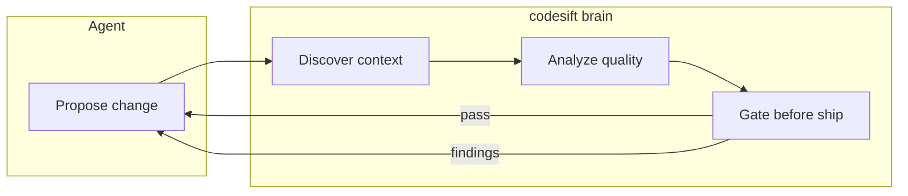
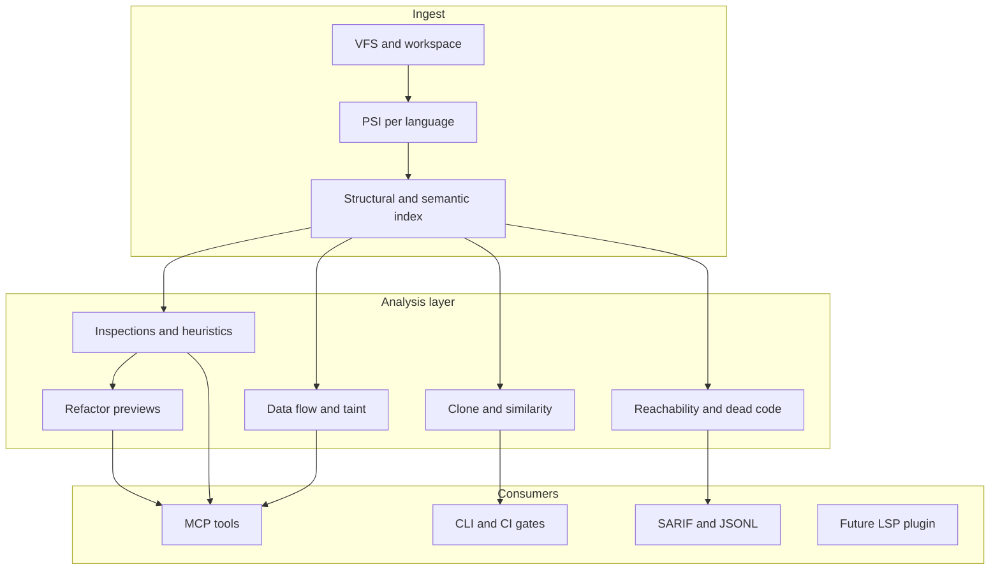

# Big Picture: Code Intelligence for Agents

**Status:** draft

This document describes the long-term north star for codesift: not only indexing and search, but **deep code intelligence** that helps agents and CI explore, understand, and change codebases at any scale — with evidence, not guesses.

For the concise problem statement and near-term solution, see [vision.md](vision.md).

## North star

> **codesift sifts codebases at any scale** by combining persistent structure, semantic retrieval, and deepening static analysis — so agents explore with evidence and ship changes that pass intelligence gates, not vibes.

> **codesift is IntelliJ for agents** — the **brain and engine**, not the GUI. It provides the indexing, analysis, heuristics, and quality intelligence that make JetBrains IDEs indispensable, exposed as MCP tools and CLI for any agent or CI pipeline.

Today codesift is scoped as an **index + query engine** (see [capabilities.md](capabilities.md)). This document defines the **analysis pillar** that grows on top of that foundation: inspections, quality signals, data-flow hints, and refactor intelligence — **exported for agents and CI**, not locked inside an editor.

## What agents should write (quality dimensions)

codesift exists so agents produce code that is not merely syntactically valid, but **grounded in the codebase and held to engineering standards**. Every dimension below maps to concrete intelligence codesift will provide (now or in later phases):

| Dimension | What it means for agents | How codesift helps |
|-----------|--------------------------|-------------------|
| **Idiomatic** | Match local conventions, patterns, and style of the repo | Semantic search for similar code; clone detection; style/idiom inspections; learn-from-existing-chunks |
| **Correct** | Behavior matches intent; types and refs resolve; no broken callers | Symbol resolve; `find_references` / `get_callers`; type-aware analysis (phased); tests impact preview |
| **Safe** | No panics, unwraps, races, or undefined behavior where avoidable | Language linters (Clippy, etc.); nil/null/optional flow; reachability |
| **Secure** | No injection, leaks, or trust-boundary violations | Data-flow / taint analysis; security rule adapters (Semgrep); sensitive API path tracing |
| **Performant** | Avoid obvious hot-path mistakes | [Cyclomatic/cognitive complexity](future/complexity-metrics.md); structural hints (nested loops); allocation inspections (phased) |
| **Efficient** | Appropriate algorithms, data structures, and resource use | Duplicate detection; dead code removal candidates; complexity thresholds |
| **Scalable** | Fits architecture; no accidental coupling or unbounded growth | Import/call graph; blast radius; module boundary inspections; cross-service impact |

These dimensions drive **what we index, what we analyze, and what we return to agents** — not just search hits, but **actionable findings** with severity, evidence, and fix direction.



**codesift does not replace the LLM.** It replaces guesswork with the same class of intelligence professional developers get from IntelliJ — resolve, inspections, impact analysis, and refactor safety — so agents write **idiomatic, safe, correct, secure, performant, efficient, and scalable** code.

## Why agents need more than search

Agentic development fails in predictable ways when tooling is shallow:

| Failure mode | Root cause | Intelligence that prevents it |
|--------------|------------|-------------------------------|
| Wrong file or symbol | Guessing from names | Structural index + resolve |
| Breaking callers | No impact graph | `find_references`, `get_callers`, blast radius |
| Duplicate logic | No similarity awareness | Clone / near-duplicate detection |
| Dead or unreachable code | No reachability | Usage + CFG-backed heuristics |
| Unsafe refactor | No data-flow context | Flow summaries, taint paths |
| "Looks fine" patches | No inspections | Rule findings with evidence and severity |
| Vibe-coded slop | No pre/post change gates | CI + MCP inspection workflows |

grep, embeddings-only RAG, and ad-hoc file reads are **necessary but not sufficient**. IntelliJ prevents many of these failures **before merge** through inspections, resolve, and refactor safety. Agents need the **same class of signals** as structured, queryable outputs.

## What we are building (and what we are not)

### We are building

A **code intelligence engine**:

1. **Ingest** — parse code and docs into PSI-like models (per language)
2. **Index** — persist symbols, references, call graphs, semantic chunks
3. **Analyze** — run inspections, heuristics, and integrated analyzers over the index
4. **Explain** — return findings and query results with `sym://` IDs, locations, snippets, severity
5. **Gate** — let CI and agents enforce quality before and after edits

### We are not building

| Non-goal | Rationale |
|----------|-----------|
| A full IDE | No editor UI, no intention bulbs, no plugin marketplace clone |
| Applying refactorings | Preview and evidence first; apply via LSP / ast-grep / editor |
| Replacing language servers | Complementary; LSP types and diagnostics, codesift indexes and analyzes at scale |
| Cloning Qodana / IntelliJ inspections overnight | Decades of per-language depth; integrate and grow incrementally |

See [goals-and-non-goals.md](goals-and-non-goals.md) for boundaries. This document describes **where we are going**; coverage status is in [capabilities.md](capabilities.md).

## Architecture: index foundation + analysis layer



The index (fjall, usearch, tantivy) is the **substrate**. Analysis plugins read PSI + graph data and write **findings** that agents query the same way they query symbols.

## IntelliJ for agents: brain and engine

| JetBrains IDE | codesift |
|---------------|----------|
| Editor, UI, intentions, bulbs | **No** — agents and IDEs bring their own surface |
| PSI, indexes, resolve, inspections | **Yes** — core engine |
| Refactorings (apply) | **Preview only** — apply via LSP / ast-grep / editor |
| Qodana / team quality gates | **Yes** — `codesift check` for CI and agents |

The moat JetBrains built is **deep language intelligence**. codesift's moat is making that intelligence **persistent, queryable, and agent-native** — across any repo, any scale, without locking it to one IDE.

## IntelliJ capabilities, agent-native delivery

JetBrains IDEs combine parsing, resolve, indexes, and global analysis. codesift maps those ideas to **agent-addressable capabilities**:

| IntelliJ-style capability | codesift direction | Agent / CI surface |
|---------------------------|-------------------|---------------------|
| PSI | Unified AST + symbol layer per language | Internal; drives all analysis |
| Stub / FileBasedIndex | Persistent fjall keyspaces | `query_structural`, fast cold start |
| Find Usages | Reverse ref index | `find_references`, `refs:to=` |
| Call hierarchy | Call graph edges | `get_callers`, `callees:of=` |
| Inspections | Pluggable rule engine + adapters | `run_inspections` (planned) |
| IntelliSense / resolve | Per-language resolve (phased) | `resolve_symbol` (planned) |
| Duplicate code | Token + semantic similarity | `find_duplicates` (planned) |
| Dead code | Unreferenced + unreachable heuristics | `dead_code_candidates` (planned) |
| Data flow analysis | CFG + summaries (language-specific) | `dataflow_summary`, `taint_paths` (planned) |
| Safe rename | Impact preview | `preview_rename` (planned); apply elsewhere |
| Qodana-style gates | Severity thresholds in CI | `codesift check` (planned) |

Deep dive on index mapping: [techniques/intellij-inspiration.md](techniques/intellij-inspiration.md).

## Layered intelligence roadmap

Intelligence deepens in layers. Each layer stops a class of agent mistakes.

### Layer 1 — Discovery

**Capabilities:** `structural-index-rust`, `semantic-search`, `mcp-*`, `cli-*` — see [capabilities.md](capabilities.md).

Agents stop wandering blind. They get stable `sym://` IDs and verified locations.

- [specs/query-language.md](specs/query-language.md)
- [specs/mcp.md](specs/mcp.md)
- [use-cases.md](use-cases.md) — agent workflows

### Layer 2 — Quality signals

Language-agnostic or lightly language-aware:

- Near-duplicate / clone clusters (semantic + fingerprint)
- Unreferenced exports and symbols (index-backed)
- [Cyclomatic and cognitive complexity](future/complexity-metrics.md) per function (CFG-backed)
- Doc vs implementation drift (semantic)

**Stops:** copy-paste slop and obvious dead weight.

### Layer 3 — Rule-based inspections

Plugin model over PSI:

```rust
// Conceptual — TBD at implementation
trait Inspection {
    fn id(&self) -> &str;
    fn run(&self, ctx: &AnalysisCtx) -> Vec<Finding>;
}
```

**Integrate** existing engines via adapters (Clippy, Ruff, Semgrep, ast-grep rules) rather than rewriting every lint. codesift **unifies** findings onto `sym://`, severity, category, and optional fix hints.

**Stops:** known bug classes and style violations.

### Layer 4 — Resolve and type-aware analysis (per language)

Gradual depth per language (Rust deepest first):

- Correct rename impact, not just string matches
- Typed inspections and smarter ref resolution
- Cross-crate / import graph (`structural-depth`)

**Stops:** false-positive impact reports and wrong refactor targets.

### Layer 5 — Data flow and security-shaped analysis

Language-specific CFG and points-to (lite → deep):

- Intra-procedural flow first
- Summary edges across the call graph (indexed in Layer 1)
- Taint-style paths for security-sensitive APIs

**Stops:** "user input reaches dangerous sink" class bugs in agent-generated code.

### Layer 6 — Refactor intelligence (preview only)

Not a full IntelliJ refactor engine:

- `preview_rename` — conflicts, broken refs, affected tests
- `preview_extract` / impact summaries where feasible
- Export suggestions to ast-grep or LSP `workspace/applyEdit`

**Stops:** agents from applying renames that shred the graph.

**Apply** stays in the editor, LSP, or dedicated transform tools.

## Exploring unknown codebases at any scale

Agents must not assume conventions like `fn main`. Exploration combines:

| Signal | Source | Example |
|--------|--------|---------|
| Build manifests | FileBasedIndex-style metadata | `Cargo.toml` bins, `pyproject` scripts, `package.json` main |
| Structural query | Symbol index | `symbol:name=main kind=function` (best-effort) |
| Semantic search | Embeddings + BM25 | "HTTP server startup request handling" |
| Graph traversal | Call / import edges | Follow callers from candidate entry |

Planned conveniences: `entrypoint:` query, `bootstrap` MCP tool returning ranked entry candidates (spec TBD).

On **rename or refactor**, codesift does not apply edits. It **re-indexes**: old symbol IDs are tombstoned, new IDs assigned, `workspace_rev` may bump. Agents re-resolve via name/path queries; they must not hold stale `sym://` IDs across revisions. See [specs/symbol-model.md](specs/symbol-model.md) and [specs/incremental-indexing.md](specs/incremental-indexing.md).

## Anti-slop: agent workflow with intelligence gates

Recommended loop for agentic changes (policy via MCP tool descriptions, Cursor rules, or skills — **no model fine-tuning required**):

```
1. index_status                    → index fresh?
2. search_semantic / query_structural → locate area
3. find_references + get_callers    → impact before edit
4. run_inspections (scope)          → existing smells (planned)
5. find_duplicates (near change)      → don't duplicate (planned)
6. agent proposes edit
7. run_inspections (post-edit)      → incremental re-check (planned)
8. CI: codesift check --min-severity=warning (planned)
```

Modern models use MCP schemas and instructions; a **codesift exploration skill** can encode this playbook without post-training.

## Build vs integrate

| Capability | Build in codesift | Integrate |
|------------|-------------------|-----------|
| Index + call/ref graph | **Yes** (core) | — |
| Semantic + structural search | **Yes** (core) | — |
| Clone / similarity detection | **Yes** | — |
| Cyclomatic / cognitive complexity | **Yes** (CFG-backed) | — |
| PURL library doc index | **Yes** (integrate-first) | docs.rs, registries, local caches |
| Finding schema + CI gates | **Yes** | — |
| Rust deep semantics | Partial | rust-analyzer, Clippy |
| Python / JS / TS rules | Adapters | Ruff, ESLint, Semgrep |
| Structural rewrite apply | Preview only | ast-grep, LSP |

JetBrains depth took years per language. codesift wins by being **open, embedded, agent-first, and composable**.

## Planned analysis surfaces (sketch)

Future specs and MCP tools (not yet implemented):

| Tool / command | Purpose |
|----------------|---------|
| `run_inspections` | Run rule set; return findings with `sym://` |
| `find_duplicates` | Clone and near-duplicate clusters |
| `dead_code_candidates` | Unreferenced / unreachable symbols |
| `resolve_symbol` | Bind ref site to definition (per language) |
| `preview_rename` | Impact before rename |
| `dataflow_summary` | Flow in/out of a function (lite) |
| `get_complexity` | Cyclomatic/cognitive scores for a symbol |
| `search_library_docs` | Semantic search over PURL-indexed dependency docs |
| `resolve_libraries` | Lockfile-resolved PURLs for workspace deps |
| `codesift check` | CI gate on severity threshold |

Finding record (conceptual):

```json
{
  "id": "finding://42/inspection/unused_symbol/7f3a",
  "rule_id": "unused_symbol",
  "severity": "warning",
  "message": "Function `old_helper` is never referenced",
  "symbol_id": "sym://42/src/util.rs#function:old_helper@100:200",
  "path": "src/util.rs",
  "location": { "start_line": 10, "end_line": 25 },
  "category": "dead_code"
}
```

## Relationship to capability coverage

| Big-picture layer | Capability IDs (see [capabilities.md](capabilities.md)) |
|-------------------|--------------------------------------------------------|
| Layer 1 — Discovery | `structural-index-rust`, `semantic-search`, `mcp-*`, `cli-*`, `entry-discovery` |
| Layer 2 — Quality signals | `quality-signals`, `complexity-metrics` |
| Layer 3 — Inspections | `inspections-unified`, `analyzer-hooks` |
| Layer 4 — Resolve depth | `structural-depth`, type-aware resolve (future) |
| Layer 5 — Data flow | `dataflow-lite`, `cfg-analysis` |
| Layer 6 — Refactor preview | `refactor-preview` |

## Principles (intelligence-specific)

1. **IntelliJ brain, agent body** — deep intelligence in the engine; any agent or CI consumes it
2. **Quality by default** — optimize for idiomatic, safe, correct, secure, performant, efficient, scalable output
3. **Evidence over vibes** — every finding links to symbol, location, or graph edge
4. **Preview before apply** — codesift analyzes and explains; other tools mutate
5. **Integrate before reinvent** — adapters for mature linters and analyzers
6. **Agent-first I/O** — MCP and JSONL, not editor-only UX
7. **Scale by persistence** — index once, query and analyze many times across sessions

## See also

- [vision.md](vision.md) — concise problem and solution
- [goals-and-non-goals.md](goals-and-non-goals.md) — boundaries
- [capabilities.md](capabilities.md) — feature coverage matrix
- [use-cases.md](use-cases.md) — consumers including agents
- [techniques/intellij-inspiration.md](techniques/intellij-inspiration.md)
- [references/comparable-tools.md](references/comparable-tools.md)
- [future/complexity-metrics.md](future/complexity-metrics.md) — cyclomatic/cognitive complexity
- [future/purl-library-docs.md](future/purl-library-docs.md) — local PURL library doc index
- [specs/mcp.md](specs/mcp.md)
