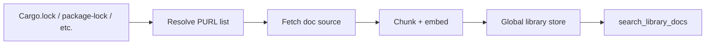

# PURL Library Docs

**Status:** exploring

Local indexing of **dependency and stdlib documentation** — PURL-addressed, cached on disk, shared across projects. Long-term replacement for cloud doc lookups (e.g. Context7) while staying **local-first**.

## Problem

Agents need library API context constantly. Today:

| Approach | Gap |
|----------|-----|
| Context7 / web MCP | Network, rate limits, version drift, private deps unsupported |
| `cargo doc` / read crate source | Per-project, repeated fetches, high token cost |
| Embedding whole crates | Expensive; no stable cross-project cache |

codesift should answer: **“What does `serde::Deserialize` expect?”** from a **local, version-pinned index** with semantic search.

## Strategy: integrate first

Do **not** build a full global doc corpus before proving value.

| Phase | Name | Scope |
|-------|------|-------|
| **A** | Integrate-first | On demand: resolve dep from lockfile → fetch/cache docs → embed chunks |
| **B** | Shared cache | Cross-project dedup by PURL + content hash |
| **C** | Proactive index | Pre-index declared deps at `codesift index` time |

Phase A ships first. Phases B–C follow when cache hit rate justifies storage.

## PURL addressing

Use [Package URL (PURL)](https://github.com/package-url/purl-spec) as the canonical library identity:

```
pkg:cargo/serde@1.0.203
pkg:npm/lodash@4.17.21
pkg:pypi/requests@2.31.0
pkg:golang/github.com%2Fgorilla%2Fmux@v1.8.0
```

| Field | Role |
|-------|------|
| `type` | Ecosystem (`cargo`, `npm`, `pypi`, …) |
| `name` | Package name |
| `version` | Exact resolved version from lockfile |
| `namespace` | Optional (npm scope, Go module path) |

Workspace projects **never** guess versions — always bind to **lockfile-resolved** PURLs.

## Resolution flow



### Doc sources (integrate-first)

| Ecosystem | Primary source | Fallback |
|-----------|----------------|----------|
| Rust | [docs.rs](https://docs.rs) API / `cargo doc --document-private-items` | Crate source + `///` rustdoc |
| npm | `node_modules/{pkg}/README.md` + typedoc if present | Registry readme |
| Python | `site-packages` docstrings / Sphinx `_build` | PyPI description |
| Go | `go doc` / module cache README | Source godoc |

Fetch is **lazy** on first query or explicit `codesift lib index` (proposed).

## Storage layout

**Per-workspace** index remains `.codesift/` (see [specs/storage.md](../specs/storage.md)).

**Global library store** (proposed) — shared across projects on the machine:

```
~/.codesift/global/                    # override: CODESIFT_GLOBAL_PATH
├── meta.json                          # store version, last GC
├── libraries/
│   └── pkg:cargo/serde@1.0.203/
│       ├── meta.json                  # purl, fetched_at, source_url
│       ├── chunks/                    # ChunkRecords (same schema as workspace)
│       ├── vectors/                   # usearch index for this library
│       └── text/                      # tantivy BM25 for API names
└── embedding_cache/                   # shared Vec<f32> by content hash
```

Embedding cache deduplicates identical doc sections across versions when content hash matches.

### Workspace linkage

Per-project `.codesift/meta.json` gains `resolved_libraries`:

```json
{
  "resolved_libraries": [
    "pkg:cargo/serde@1.0.203",
    "pkg:cargo/tokio@1.38.0"
  ]
}
```

Queries can scope: `search_library_docs` with optional `purl` filter.

## Chunking library docs

Reuse [chunking-and-semantic.md](../specs/chunking-and-semantic.md) boundaries:

| Chunk kind | Example |
|------------|---------|
| `item` | Single function/type doc with signature |
| `module` | Module-level overview |
| `example` | `# Examples` section |
| `readme` | Crate/package README section |

Metadata per chunk:

```json
{
  "chunk_id": "libchunk://pkg:cargo/serde@1.0.203/Deserialize/trait",
  "purl": "pkg:cargo/serde@1.0.203",
  "item_path": "serde::Deserialize",
  "kind": "trait",
  "language": "rust"
}
```

## CLI (proposed)

```bash
# Resolve and cache docs for lockfile deps (Rust MVP)
codesift lib resolve --workspace .

# Pre-index all resolved libraries
codesift lib index

# Search library docs
codesift lib search "deserialize struct with lifetime parameters" --purl pkg:cargo/serde@1.0.203

# Status
codesift lib status
```

## MCP tools (proposed)

### `search_library_docs`

**Input:**

```json
{
  "query": "how to deserialize with custom field names",
  "purl": "pkg:cargo/serde@1.0.203",
  "limit": 10
}
```

**Output:** Same shape as `search_semantic` hits, with `purl` and `item_path` on each result.

### `resolve_libraries`

Returns PURLs resolved from current workspace lockfiles (no fetch).

```json
{
  "libraries": [
    { "purl": "pkg:cargo/serde@1.0.203", "indexed": true, "chunks": 842 },
    { "purl": "pkg:cargo/tokio@1.38.0", "indexed": false }
  ]
}
```

## Agent workflow

```
1. resolve_libraries()              → what's available locally?
2. search_library_docs(query, purl) → API usage for dep
3. search_semantic(query)           → how *this repo* uses the API
4. get_callers / find_references    → impact in workspace code
```

Combines **external doc intelligence** with **in-repo usage patterns** — higher SNR than either alone.

## Privacy and offline

- Default: fetch only from local `cargo`/`npm` caches and public registries; no telemetry
- Private crates: index from **local path / git dependency** source; PURL uses `source` qualifier (TBD)
- Air-gapped: `codesift lib import /path/to/exported` (future)

## Non-goals (near-term)

| Non-goal | Rationale |
|----------|-----------|
| Host a public doc registry | Local-first; not Sourcegraph |
| Replace docs.rs website | Cache and search, not browse UI |
| Index entire crates.io | Only **resolved** deps for indexed workspaces |
| Real-time registry polling | Lockfile-driven versions only |

## Coverage (integrate-first)

| Step | Deliverable | Prerequisite |
|------|-------------|--------------|
| A | `resolve_libraries` for Cargo.lock | `structural-index-rust` |
| B | Global store layout, embedding cache dedup | `semantic-search` |
| C | `search_library_docs` MCP + CLI; docs.rs | A + B |
| D | npm, PyPI backends | C |
| E | Proactive `lib index` on workspace index | C |

Promote to [capabilities.md](../capabilities.md) when `spec-accepted`.

## See also

- [specs/chunking-and-semantic.md](../specs/chunking-and-semantic.md) — chunk and embed pipeline
- [specs/storage.md](../specs/storage.md) — workspace index layout
- [references/comparable-tools.md](../references/comparable-tools.md) — Context7 / codedb positioning
- [big-picture.md](../big-picture.md) — local dependency intelligence
