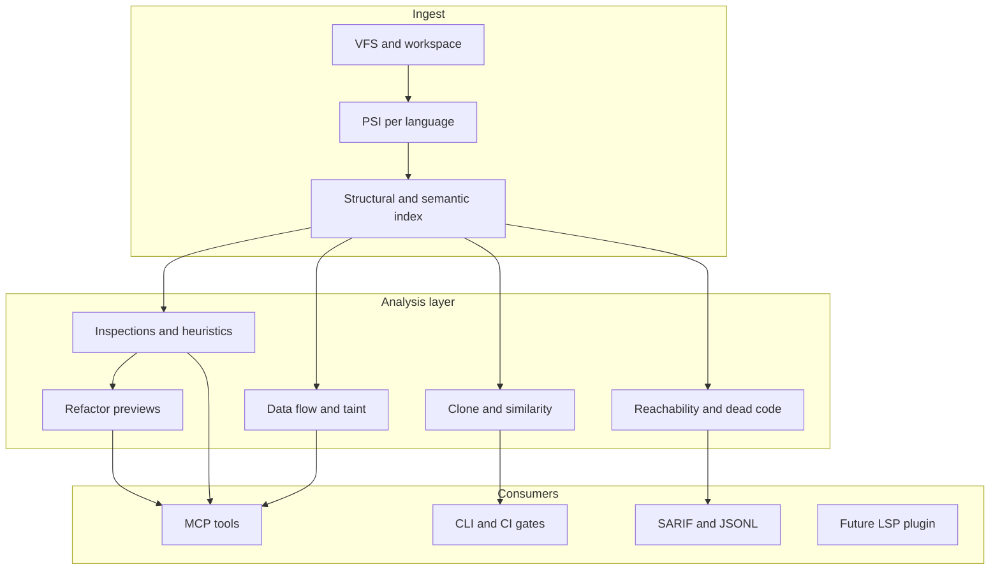

# Big Picture: Code Intelligence for Agents

> **Type:** product · **Audience:** contributor · **Read when:** planning analysis-layer capabilities (optional after [vision.md](vision.md))

**Status:** draft

Long-term north star: not only indexing and search, but **deep code intelligence** — inspections, quality signals, data-flow hints, and refactor preview — exported for agents and CI, not locked in an editor.

For the concise pitch and near-term scope, see [vision.md](vision.md). Boundaries: [goals-and-non-goals.md](goals-and-non-goals.md). Coverage status: [capabilities.md](../capabilities.md).

## North star

> **codesift sifts codebases at any scale** by combining persistent structure, semantic retrieval, and deepening static analysis — so agents explore with evidence and ship changes that pass intelligence gates, not vibes.

Today codesift is an **index + query engine**. This document defines the **analysis pillar** that grows on that foundation.

**codesift does not replace the LLM.** It replaces guesswork with resolve, inspections, impact analysis, and refactor safety — the class of intelligence professional IDEs provide. Quality dimensions (idiomatic, correct, safe, secure, performant, efficient, scalable) are spelled out in [vision.md](vision.md#success-criteria).

IntelliJ concept mapping lives in [techniques/intellij-inspiration.md](../techniques/intellij-inspiration.md) — not repeated here.

## Architecture: index foundation + analysis layer

The index (fjall, usearch, tantivy) is the **substrate**. Analysis plugins read PSI + graph data and write **findings** queryable like symbols.

## Intelligence layers

Layers deepen over time. Each stops a class of agent mistakes. Capability IDs and status: [capabilities.md](../capabilities.md#layer-mapping-big-picture).

| Layer | Stops | Primary docs |
|-------|-------|--------------|
| 1 — Discovery | Blind wandering; unstable locations | [specs/mcp.md](../specs/mcp.md), [use-cases.md](use-cases.md) |
| 2 — Quality signals | Copy-paste slop, dead weight | [future/inspections-and-findings.md](../future/inspections-and-findings.md) |
| 3 — Inspections | Known bug classes, style violations | [future/inspections-and-findings.md](../future/inspections-and-findings.md) |
| 4 — Resolve depth | False-positive impact, wrong refactor targets | [milestones/structural-depth.md](../milestones/structural-depth.md) |
| 5 — Data flow | Trust-boundary and taint bugs | [future/complexity-metrics.md](../future/complexity-metrics.md) |
| 6 — Refactor preview | Graph-shredding renames | [future/inspections-and-findings.md](../future/inspections-and-findings.md) |

## Build vs integrate

| Capability | Build in codesift | Integrate |
|------------|-------------------|-----------|
| Index + call/ref graph | **Yes** (core) | — |
| Semantic + structural search | **Yes** (core) | — |
| Clone / similarity detection | **Yes** | — |
| Cyclomatic / cognitive complexity | **Yes** (CFG-backed) | — |
| PURL library doc index | **Yes** (integrate-first) | docs.rs, registries, local caches |
| Finding schema + CI gates | **Yes** | — |
| Rust deep semantics | Partial | rust-analyzer, Clippy |
| Python / JS / TS rules | Adapters | Ruff, ESLint, Semgrep |
| Structural rewrite apply | Preview only | ast-grep, LSP |

JetBrains depth took years per language. codesift wins by being **open, embedded, agent-first, and composable**.

## Principles

1. **IntelliJ brain, agent body** — deep intelligence in the engine; any agent or CI consumes it
2. **Evidence over vibes** — every finding links to symbol, location, or graph edge
3. **Preview before apply** — codesift analyzes and explains; other tools mutate
4. **Integrate before reinvent** — adapters for mature linters and analyzers
5. **Agent-first I/O** — MCP and JSONL, not editor-only UX
6. **Scale by persistence** — index once, query and analyze many times across sessions

## See also

- [vision.md](vision.md) — problem, solution, success criteria
- [use-cases.md](use-cases.md) — agent workflows
- [future/inspections-and-findings.md](../future/inspections-and-findings.md) — planned tools, findings schema, agent gate loop
- [capabilities.md](../capabilities.md) — feature coverage matrix
